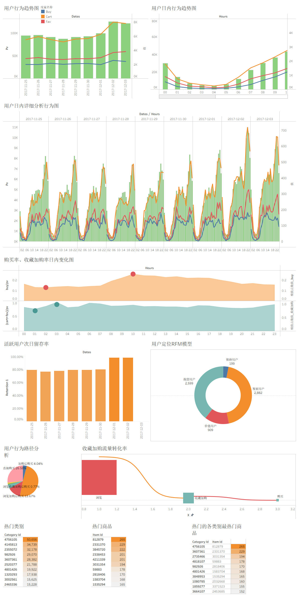

# 电商用户行为数据分析（MySQL 实战）

用 SQL 完成一次从原始数据到可视化的完整分析链路：数据清洗 → 指标体系 → 用户分层 →
商品分析 → 推荐算法 → Tableau 仪表板。

## 关于这个项目

这是我学习数据分析过程中的一次完整实战练习。数据集采用阿里天池公开的淘宝用户行为数据，
**分析框架参考了 B 站教程《【MySQL实战】基于 100 万真实电商用户的 1 亿条行为数据分析》**
（[视频链接](https://www.bilibili.com/video/BV1S94y1Z7xc/)），
SQL 代码、表结构设计、性能调优与 Tableau 可视化由我独立完成。

把过程整理成仓库，是因为我在这个项目里做的调整和踩过的坑，比最终那几十条查询语句本身
更能说明我学到了什么，所以连同原始稿一并保留了下来。

### 在教程基础上做的调整

- **数据量缩减与主键重建**：原表 9100 万行 / 9.09 GB，本机跑不动全表 `GROUP BY` 查重和
  自连接去重。我保留了前 100 万行，并补上自增主键 `id`，让这类全表操作从"跑不动"
  变成秒级。这是一个有代价的取舍——样本量下降会影响长尾商品的统计显著性，
  我在商品分析部分会注意到这个问题。
- **补写可复现的建表脚本**：教程走 Workbench 导入向导建表，别人拿到仓库无法复现。
  我补写了 DDL 和 `LOAD DATA` 两种导入方式，让整个流程可以照着跑一遍。
- **开发沙箱**：全表调试 SQL 代价太高，我复制了一张 10 万行的 `temp_behavior` 临时表，
  之后每个查询都按「小样本验证 → 全量执行」两段写。这是我在这个项目里最受益的一个习惯。
- **处理口径不合理的地方**：数据集没有会话（session）标识，标准的跳失率根本算不出来。
  我没有硬套公式，而是退一步用「全期仅 1 条记录的用户」作近似口径，并在文件里写明了
  这个妥协以及它的局限。同样地，RFM 模型因为数据集没有金额字段，M 维度做不了，
  我就只做了 R 和 F，没有用「购买次数」去凑一个假的 M。

### 踩过的坑

- **`innodb_buffer_pool_size` 设成 8G 导致 MySQL 崩溃**：按经验值调参是危险的，
  缓冲池大小要看机器的实际可用内存，不是越大越好。
- **Workbench 长查询固定在 600 秒断连**：一开始以为是服务端超时，查了
  `max_execution_time`、`wait_timeout` 都不对，最后发现是客户端的
  `DbSqlEditor:ReadTimeOut` 默认值，调到 3600 才正常。
  排查过程让我意识到"断连"要分清楚是客户端还是服务端的问题。
- **统计学意义上的坑**：把 9100 万行砍到 100 万行后，很多本来成立的分析结论
  需要重新检查。比如长尾商品的转化率，在小样本下波动会非常大。

## 仪表板预览



> 由 **12 个工作表 + 1 个仪表板**组成，涵盖用户行为趋势、日内行为节律、购买率 / 收藏加购率
> 变化、次日留存、RFM 分层、收藏加购转化路径（桑基图）、热门商品热力图等。
>
> 工作簿源文件 `MYSQL实战.twb` 含本机数据库连接信息，已加入 `.gitignore` 不入库；
> 上方为导出的静态快照。

## 数据集

| 项目 | 说明 |
|---|---|
| 表名 | `taobao.user_behavior` |
| 规模 | **约 100 万行**（原表 9100 万行 / 9.09 GB，已按需求抽样保留前 100 万行） |
| 原始字段 | `user_id`、`item_id`、`category_id`、`behavior_type`、`timestamps`（整型 Unix 秒） |
| 清洗后新增 | `id`（自增主键）、`datetimes`、`dates`、`times`、`hours` |
| 引擎 / 行格式 | InnoDB / Dynamic |
| 索引 | 主键 `id`，另有 5 个单列索引（`user_id` / `item_id` / `category_id` / `behavior_type` / `timestamps`） |

> 数据文件不入库（GitHub 单文件上限 100 MB）。本仓库只保存**查询语句和文档**。

## 目录结构

```
docs/                   分析框架思维导图（XMind）
images/                 仪表板导出快照
sql/
├─ 00_数据准备/         数据获取、清洗与预处理（含 10 万行开发沙箱）
├─ 01_人/               用户维度分析
│   ├─ 01_获客情况/      PV、UV、浏览深度
│   ├─ 02_留存情况/      留存率、跳失率
│   ├─ 03_行为情况/      时间序列、转化率、行为路径
│   └─ 04_用户定位/      RFM 模型、付费分层
├─ 02_货/               商品维度分析
├─ 03_平台/             平台功能与推荐系统
└─ 04_数据可视化/
```

**约定：一个 `.sql` 文件 = 一个独立查询。** 文件头部注释写明功能、所属板块、依赖表、复杂度，
方便单独执行、对比优化效果、在 GitHub 上看 diff。

**开发沙箱**：全表 100 万行直接调 SQL 代价太大，`sql/00_数据准备/10_开发沙箱_临时表.sql`
会复制出 10 万行的 `temp_behavior` 供秒级验证。各分析文件都按「小样本验证 → 全量执行」
两段写，先在沙箱里确认语法和结果，再对真实表跑。分析产出的结果表（如 `pv_uv_puv`）
单独建表落库，供可视化层取数。

**原始稿**：每次交付的原始 SQL 归档在仓库外的 `../_本机专用/原始稿/`，
与整理后的版本对照着看，能看出改了哪些地方、为什么改。

## 分析进度

### 数据准备
- [x] 建库建表 — 补写了可复现的 DDL（原本走 Workbench 导入向导）
- [x] 导入数据 — LOAD DATA 与导入向导两种方式都给全
- [x] 创建索引
- [x] 检查空值 — 整表无空值
- [x] 检查重复值 — 存在重复
- [x] 数据去重 — 每组保留 `id` 最小的一行
- [x] 增加日期 / 时间 / 小时段字段
- [x] 剔除异常值 — 仅保留 2017-11-25 ~ 2017-12-03
- [x] 数据概览 — 清洗后 **999,489 条**

### 人

**获客情况**
- [x] 页面浏览量（PageView）
- [x] 独立访客数（Unique Visitor）
- [x] 浏览深度 PV/UV — 三个指标落地为结果表 `pv_uv_puv`

**留存情况**
- [x] 留存率 — 结果落地为 `retention_rate` 表
- [x] 跳失率 — 近似口径（数据集无会话概念，按「全期仅 1 条记录的用户」计）

**行为情况**
- [x] 周内行为（时间序列）— 基于 `date_hour_behavior` 按星期几汇总（取日均值）
- [x] 日内行为（时间序列）— 产出 `date_hour_behavior` 表（日期 × 小时）
- [x] 用户转化率分析 — 产出 `behavior_user_num` / `behavior_num` 表
- [x] 行为路径分析 — 产出 `path_result` 表

**用户定位**
- [x] 付费 / 非付费 — 产出 `user_pay_split` 表，并细分非付费用户的「有意向未成交 / 纯闲逛」
- [x] RFM 模型 — 产出 `rfm_model` 表（只做 R、F 两维；数据集无金额字段，M 维度做不了）

### 货
- [x] 按热度分类 — 产出 `popular_categories` / `popular_items` / `popular_cateitems` 表
- [x] 商品转化率 — 产出 `item_detail` / `category_detail` 表
- [ ] 商品特征分析 — 点击量 × 购买量矩阵，取数自 `category_detail`，在 Tableau 中探索

### 平台
- [x] 功能路线优化 — 转化漏斗 + 流失点定位，产出 `funnel_conversion` 表
- [x] 推荐系统的构建与完善 — 纯 SQL 的 Item-CF 共现推荐，产出 `item_similarity` / `recommend_result` 表

### 数据可视化
- [x] Tableau 工作簿 `MYSQL实战.twb` — **12 个工作表 + 1 个仪表板**
      （含本机连接信息，已加入 `.gitignore` 不入库；分析产出的表供其取数）

## 运行环境

| 项目 | 说明 |
|---|---|
| MySQL | 26.7（Innovation） |
| 客户端 | MySQL Workbench 8.0 |
| 关键配置 | `innodb_buffer_pool_size = 8G`、`innodb_redo_log_capacity = 1G` |

> ⚠️ **两条注意事项**
> 1. 表已从 9100 万行缩到 100 万行，原本跑不动的全表操作（`GROUP BY` 查重、自连接去重）
>    现在都是秒级。
> 2. Workbench 的 `DbSqlEditor:ReadTimeOut` 建议调到 **3600**，长任务才不会在第 600 秒断连。

---

## 关于我

赵梁屹，中国石油大学（北京）金融学专业本科生。

这个项目是我的数据分析练习记录，用于理解和练习 SQL 在实际业务分析中的应用。
如果你在看这份仓库，欢迎指出问题——我知道自己在数据建模和查询优化上都还是入门水平，
尤其是小样本带来的统计偏差问题，目前还没有很好的处理办法。

GitHub：https://github.com/zhaoliangyi0-lang
